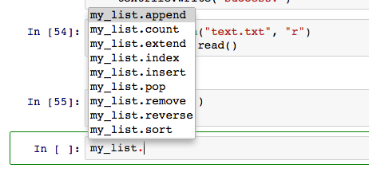

今天再次完成[Codecademy的Python課程](https://www.codecademy.com/learn/python)，這次主要是複習，把之前忘記的部份補回來。這次主要的收穫是一些學習Python的技巧，還有求救方式，以下幾點可以作為日後參考：

## ipython notebook
- 一定要實際使用ipython notebook(jupyter)或python學習，在codecademy無法先試著執行程式，確認自己是否正確，但是在自己的電腦直接使用ipython notebook，很快就會知道答案了。

## tab

- 在ipython notebook上愛用`tab`鍵，可以幫助自己觀察每個object之下還有哪些method或變數。
    
      

## tutorialspoint

- [http://www.tutorialspoint.com/python/index.htm](http://www.tutorialspoint.com/python/index.htm): 好用的網站，一些基本的規則可以在這邊看，搭配jupyter服用，效果加倍。

## hellp

- 愛用help：在ipython notebook上，`import module`後，用`help(module)`或`help(function)`，可以觀察這些module和function的用法。如果在python使用，可以先打`help()`進入online help utility，再直接打上module或function的名稱就可以查詢了。（module其實就像R的package）

		import math
   		help(math.ceil)

    Help on built-in function ceil in module math:
    
    ceil(...)
        
     ceil(x)
     
     Return the ceiling of x as a float.
     
     This is the smallest integral value >= x.
    

    
