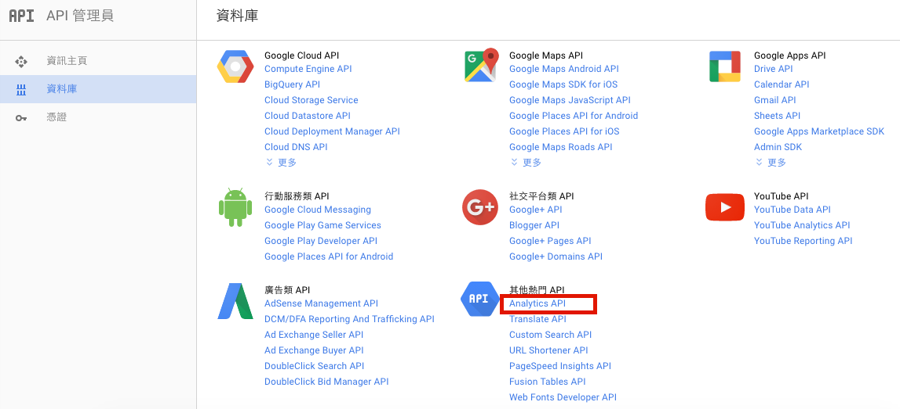
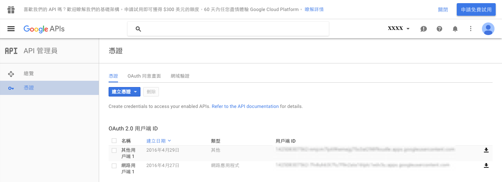
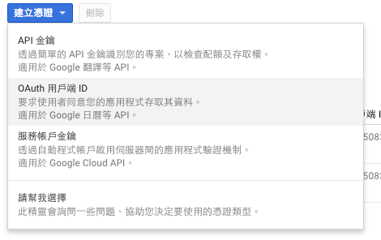
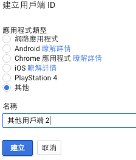
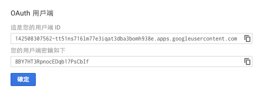
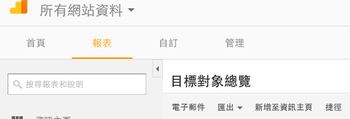
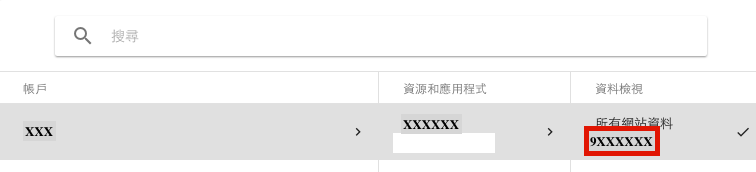

### 之前為了觀察公司產品銷售情況，利用`RGoogleAnalytics`這個套件，完成Google Analytics與R串接。雖然`RGoogleAnalytics`的說明文件裡，寫得還蠻清楚的，但當初在使用時，還是有些部分需要自己想辦法，趁自己尚未完全忘記之前，趕快來筆記一下。

## 取得Client ID and secret：

#### 1. 到https://console.developers.google.com。

#### 2. 選擇Analystics API，啟用API。



#### 3. 進入憑證頁面。



#### 4. 點選憑證，選擇『OAuth用戶端ID』。



#### 5. 點選其他並命名。



#### 6. Get Client ID and secret! 



### 接著，就可以執行以下指令了：

```{r, eval=FALSE}
library(RGoogleAnalytics)
# 取得Token
test_au=Auth(client.id, client.secret)
# 驗證Token
ValidateToken(test_au)
```

### 如果之前曾經用R儲存過跟google API相關的token，就會出現以下的問題，請選擇`NO`：
```{r, eval=FALSE}
Use a local file ('.httr-oauth'), to cache OAuth access credentials between R sessions?

1: Yes
2: No
```

## 設定查詢的條件：

```{r, eval=FALSE}
query.list <- Init(start.date='2016-07-01',
                   end.date='2016-07-29',
                   dimensions="ga:date",
                   metrics="ga:transactionRevenue",
                   max.results=10000,
                   sort="-ga:date",
                   table.id="ga:xxxxxxxx")
```

### 這部分有幾個地方要注意：

#### 1. dimensions指的是我要以哪個面向來抓資料，而metrics指的是要下載的資料內容，以上面的code為例，即是抓每一天的交易額。不同dimensions相對應的metrics不同，所以要設定正確。詳情可看[Dimensions & Metrics Explorer](https://developers.google.com/analytics/devguides/reporting/core/dimsmets#cats=session,traffic_sources,ad_exchange,adsense,adwords,user,goal_conversions,platform_or_device,geo_network,system,social_activities,page_tracking,content_grouping,internal_search,site_speed,app_tracking,event_tracking,ecommerce,social_interactions,user_timings,exceptions,content_experiments,custom_variables_or_columns,time,doubleclick_campaign_manager,audience,lifetime_value_and_cohorts,channel_grouping,related_products)

#### 2. 每個網站的資料都會有一個相對應的table ID，進到網站的GA頁面，可以點選左上角的『所有網站資料』，就可以看到有個資料檢視的欄位，裡面的數字就是table ID，共八個數字。別忘記在數字之前加上`ga:`。





### 困難的部分結束囉～～剩下的事情就只是資料下載與整理。

## 下載

```{r, eval=FALSE}
ga.query <- QueryBuilder(query.list)

transactions <- GetReportData(ga.query,
                         test_au,
                         split_daywise=T,
                         delayedAssign(5))
transactions=transactions %>% 
  arrange(date) %>% 
  mutate(group=factor("Revenue"),
         date=seq(as.Date("2016-07-01"),as.Date("2016-07-29"),"days"))
```

### 稍微整理一下，就可以畫成趨勢圖了：

```{r, echo=FALSE,message=FALSE,warning=FALSE,fig.width=10}
load('transations.RData')
library(ggplot2)
library(dplyr)
ggplot(transactions,aes(x=date,y=transactionRevenue))+
  geom_line(aes(group=group))+
  geom_point()+scale_x_date(date_breaks = "5 days")
```
