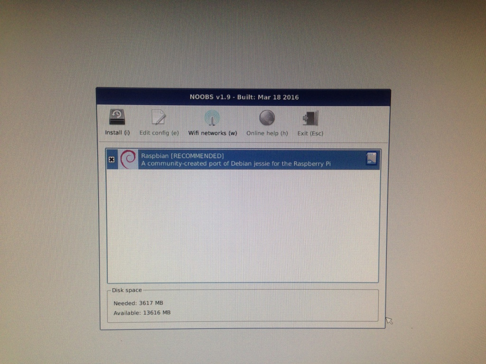
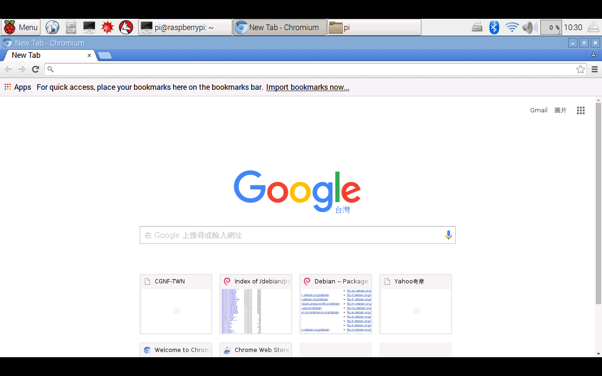

### 為了以最小金額架伺服器，Raspberry Pi 變成最近研究的課題了。在網路上很容易可以買到Raspberry Pi以及相關的配件，身為一個新手，不想要耗費太多大腦，所以購入最適合新手的品項：
#### 1. Raspberry Pi 3 Model B
#### 2. 工控 ABS 透明殼(可壁掛) + 三片散熱片 NT$150
#### 3. 樹莓派記憶卡: 加購 金士頓 16G / C10 含安裝 NOOBS 多系統開機
#### 4. 樹莓派大電流供電組: 東芝 TOSHIBA 10W USB 電源器 + JBL 5V4A 數據電源線 NT$220
#### 5. 其他配件選購: SONY HDMI v1.4 視訊傳輸線 NT$95

## 開始安裝Raspberry Pi

### Raspberry Pi的基本硬體安裝不是太困難，一開始只要接上滑鼠、鍵盤和螢幕，插入SD卡，最後接上電源，就可以看到開機畫面。由於這次買的配件，根本就是新手包，SD卡已經內裝NOOBS了，所以省掉下載作業系統安裝程式的時間。NOOBS是給新手用的作業系統安裝程式，內涵Raspbian，而Raspbian則是Debain-based 的Linux作業系統，所以接下來都可以用Debian Linux的指令操作。

###安裝Rsapbian非常簡單，大概是這篇中最簡單的部分，只要選擇Raspbian，點下install，然後等個半小時左右就結束了。


## 安裝中文環境
### 安裝完之後，畫面就是一個大樹莓的桌面（跟Pokemon Go的Razz Berry有九成像），似乎一切都很美好，但打開瀏覽器，就會發現，這時的Raspbian沒有中文環境......，身為一個台灣人還是需要中文環境啊~~所以需要來調整一下語言環境：

#### 1. 調整之前先update一下套件
```{shell, eval=FALSE}
sudo apt-get update
```

#### 2. 然後安裝中文字型：文泉驛微米黑、文泉驛正黑、文泉驛點陣宋體。（這裡真的要感謝葉難的網誌)
```{r, eval=FALSE}
sudo apt-get install ttf-wqy-microhei ttf-wqy-zenhei xfonts-wqy
```

### 經過以上步驟，現在應該就可以顯示中文了，不過還是不能輸入中文，所以還需要以下步驟：

#### 3. 設定locales

```{r, eval=FALSE}
sudo dpkg-reconfigure locales
```

#### 選擇en_US.UTF-8 UTF-8、zh_TW BIG5、zh_TW.EUC_TW EUC-TW、zh_TW.UTF-8 UTF-8，使用空白鍵選擇。這個步驟如果選錯，那之後的中文輸入就會變得很怪異。


#### 4. 安裝中文輸入法`scim-chewing`。

```{r, eval=FALSE}
sudo apt-get install scim scim-table-zh scim-chewing
```

### 接下來就可以使用中文輸入了，`Ctrl+space`可以轉換中英文輸入，跟一般用法相同。

## 遠端控制
### 遠端控制最好要有固定IP，否則出門在外，就不容易連進家裡的Raspberry Pi了。除了用`ssh`之外，介紹兩個方法：

#### - TeamViewer：相信大家都對此不陌生，TeamViewer也有出給Raspberry Pi的版本，讓大家可以不用固定IP，也可以靠ID連進Raspberry Pi，網址：[https://www.teamviewer.com/iotcontest/](https://www.teamviewer.com/iotcontest/)。不過，這是免費版本，畫面有點小，而且連線三小時斷線之後，就可能連不上了......。

#### - Microsoft Remote Desktop：這個真的頗好用，不過從外面連進來，一樣會需要固定IP。首先，會需要在Raspberry Pi執行`sudo apt-get -y install xrdp`，安裝xrdp。接著，在自己的電腦安裝Microsoft Remote Desktop，再設定一下連線的參數，就可以開心連線了。

## 設定時區

### 因為Raspberry Pi是英國生產的，所以時區當然是英國時區，這對台灣人來說不太方便，按照以下步驟可以改成台灣時區：

#### 1. 在terminal執行`tzselect`，選擇Asia，再選擇Taiwan。
#### 2. 在`/home/pi/`執行`nano .profile`之後，進入`.profile`新增一行`TZ='Asia/Taipei'; export TZ`，然後重開機。
#### 3. 執行`sudo cp /usr/share/zoneinfo/Asia/Taipei /etc/localtim`，這一步影響到***crontab***的時間，非常重要！

### 接下來，應該Raspberry Pi就完全是台北標準時間了！


## 安裝chrome的姊妹品- Chromium

### 雖然Raspbian有內建瀏覽器`Web`，不過還是有一點不習慣，但似乎也沒辦法直接安裝Chrome，所以只好安裝Chromium了。Chromium相當於Chrome的工程版，之前Arch Linux也需要安裝Chromium。執行以下指令，就可以完成安裝了：

```{r, eval=FALSE}
# 抓安裝檔
wget https://dl.dropboxusercontent.com/u/87113035/chromium-browser-l10n_45.0.2454.85-0ubuntu0.15.04.1.1181_all.deb
wget https://dl.dropboxusercontent.com/u/87113035/chromium-browser_45.0.2454.85-0ubuntu0.15.04.1.1181_armhf.deb
wget https://dl.dropboxusercontent.com/u/87113035/chromium-codecs-ffmpeg-extra_45.0.2454.85-0ubuntu0.15.04.1.1181_armhf.deb

#開始安裝
sudo dpkg -i chromium-codecs-ffmpeg-extra_45.0.2454.85-0ubuntu0.15.04.1.1181_armhf.deb
sudo dpkg -i chromium-browser-l10n_45.0.2454.85-0ubuntu0.15.04.1.1181_all.deb chromium-browser_45.0.2454.85-0ubuntu0.15.04.1.1181_armhf.deb
```



### 做到這一步，Raspberry Pi就比較像是一台普通人可以使用的電腦了！不過，接下來還有各種地雷要踩，下一個就是來裝`R`了......