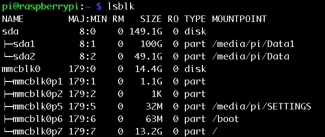
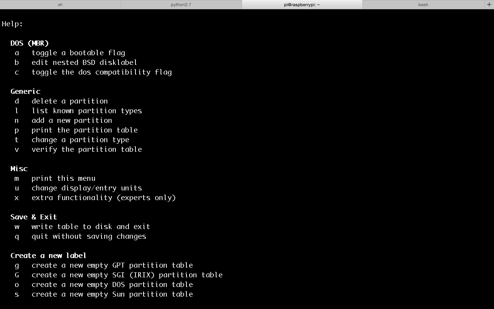

### 之前留了一顆從舊筆電拆下來的160G硬碟，曾經被拿來應急，安裝了Ubuntu，一段時間沒用後，似乎再也讀不到Ubuntu，剛好可以拿來當作擴充Raspberry Pi的硬碟。

### 試了Arch、Windows和Mac，似乎只剩下Mac可以讀到這顆硬碟，只好先用Mac將它格式化。

## 硬碟工具程式

### 首先先找到硬碟工具程式。

### 然後，選擇清除，格式選擇*MS-DOS (FAT)*，填上自己喜歡的名字之後，按下清除。

### 選擇*FAT*，其實就是將檔案系統格式設定為*FAT32*，FAT32對熱插拔支援性較強，單一檔案上限 4GB。如果選擇*ExFAT*的話，就不限制單一檔案大小，算是FAT32的改良版，但是Raspberry Pi不支援。至於MAC OS擴充格式，也就是*HFS+*，Raspberry Pi也無法支援，不過這對Mac來說則是最好的檔案系統格式，可以作為Mac 中的時光機（Time Machine）使用的檔案系統。

# Raspberry Pi擴充硬碟

### 因為*FAT32*限制單一檔案大小，所以將硬碟接上Raspberry Pi後，就應該改變成 *ext4* (Fourth extended filesystem)的檔案系統格式。*ext4*可以支援1EB的分割磁區，以及1TB的檔案。這似乎是比FAT32更好的選項。

### 接上硬碟之後，Raspberry Pi會自動掛載，可以用這個指令，`lsblk`，查看現在已掛載的儲存裝置，可以看到儲存裝置的容量，以及作為掛載點（MOUNTPOINT）的資料夾。

### 或者輸入`sudo fdisk -l`，也可以看到儲存裝置的資訊，還可以看出每個儲存裝置的檔案系統格式。

## 卸載磁碟

### 因為Raspberry Pi 會自動掛載，所以可以先卸載磁碟。

    sudo umount /media/pi/RASPDB/ #當初掛載點是/media/pi/RASPDB/

## 清理和分割

### 接下來都要靠`fdisk`來完成了，首先執行`sudo fdisk /dev/sda`，`sda`是掛載的第一個磁碟的名稱，所以第二個會叫`sdb`，以此類推。

### 一開始會看到：

    Changes will remain in memory only, until you decide to write them.
	Be careful before using the write command.

	Command (m for help):
### 如果輸入`m`，就會看到各種指令的用法：

### 如果輸入`q`就會離開，`n`則是進行下一步。然後，接下來可以指定磁區的類型，通常會是primary，所以選擇`p`。接著是錯誤示範：因為一開始硬碟在Mac時，全部的空間都已經劃分成一個磁區了，所以所以選擇磁區編號就會有問題，1號已經有人用了，且沒有空間給2號了。

### 正確的做法應該是要先刪除磁區，一開始選擇`d`。

### 再來，輸入`n`-->`p`-->輸入磁區編號-->選擇磁區初始位置-->選擇磁區大小。如果一開始沒有把整個硬碟都劃分成同一分割區，可以再進行下一個分割區的設定，設定完再輸入`w`，就完成磁區分割了。

## 格式化

### 系統會自動按照順序命名分割區名稱，第一個磁碟被分割成兩個分割區，名稱就會是`sda1`與`sda2`，分別對他們做格式化(ext4)：

    sudo mkfs.ext4 -L Data /dev/sda1
    sudo mkfs.ext4 -L Data /dev/sda2
### 結果如下：

## 掛載磁碟

### 掛載的方式其實有兩種，第一種就是直接重開機，讓系統自動掛載，掛載點就會是`/media/pi/Data`、`/media/pi/Data1`......，以此類推。另一種方式就是自己手動掛載：
#### 先建立掛載點，並且改變擁有者
    
    sudo mkdir /media/pi/Data
    sudo chown pi:pi /media/pi/Data 

#### 手動掛載：
    sudo mount -t vfat -o uid=pi,gid=pi /dev/sda1 /media/pi/Data
    
### 到這邊其實就結束了。不過，另外要注意的是，硬碟的電源是否足夠，網路上通常會建議為求穩定，最好再外接電源給硬碟。