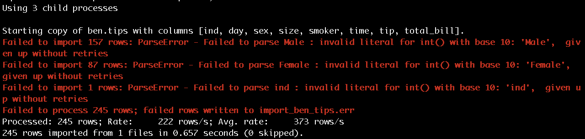
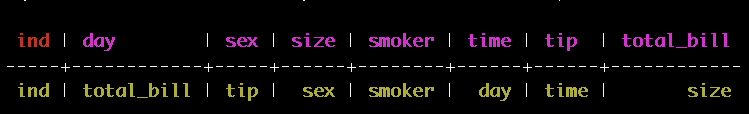

# Cassandra


## Cassandra Installation for Mac

### Method 1: Homebrew


```
brew install cassandra
pip install cqlsh
```
#### `cqlsh`是為了與cassandra連線互動的terminal，進入`cqlsh`便可以執行操作cassandra的指令。


#### 第一次以此方法操作，似乎會版本的問題（下載到3.7版），有一些指令無法順利執行，如：`copy`，所以只能殺掉舊版本，安裝新版本，以下介紹怎麼殺掉舊版本。

### Uninstall Cassandra

#### 1. 利用brew反安裝
```
brew uninstall cassandra
```

#### 2. ps檢查目前是否有cassandra相關的process

```
ps -ef | grep cassandra
```


仔細看一下，應該可以看出Cassandra的版本。另外，第二個欄位的數值是PID，砍掉這個process，會需要用到PID。

#### 3. kill process

```
kill -9 26174
```

#### 4. 以Method 2安裝Cassandra可能會遇到某process佔用port，這時執行以下script，可以找到佔用port的程序，再以上面的步驟殺掉。之後也可以用此方法關掉Cassandra，以免浪費資源。

```
lsof -i |grep :7199
```

### Method 2: Download from [http://cassandra.apache.org/download/](http://cassandra.apache.org/download/)

#### 下載後解壓縮，直接進到`appche-cassandra-3.9/bin/`，執行：

```
./cassandra
```
#### 直接在此資料夾執行

```
./cqlsh
```


## Cassandra 指令

### 建立KEYSPACE，KEYSPACE指的就是Database
```
CREATE KEYSPACE BEN
WITH REPLICATION = {'class' : 'SimpleStrategy', 'replication_factor': 3};
```

### 使用KEYSPACE
```
use BEN;
```

### 建立table
```
create table tips(ind int primary key);
```
#### 只有某個column的data可以設定為primary key。

### 輸入值到
```
insert into tips(ind) values(1234);
```

### 選擇table中所有資料
```
select * from tips;
```


### 殺掉table

```
drop table tips;
```

### 建立新table，依照每一欄位的情況設定資料格式

```
create table tips( 
			ind int primary key,
       		total_bill float,
       		tip float,
       		sex text,
       		smoker text,
       		day text,
       		time text,
       		size int);
```
### 觀察table: DESCRIBE or DESC

```
desc table tips;
```


### 從csv檔load資料
```
COPY tips FROM 'tip.csv';
```

### COPY失敗



#### 其實csv檔如果以Mac excel改過並存檔的話，可能無法用此方法讀入，可以先以python讀檔後，另外寫入新檔。在terminal，利用`file filename`可以觀察此兩個檔案的差異。

### 殺了table後，將資料格式全改成text


```
create table tips( 
		ind text primary key, 
		total_bill text, 
		tip text, 
		sex text, 
		smoker text, 
		day text, 
		time text, 
		size text);
```

```
COPY tips FROM 'tip.csv';
```
### Bug of COPY

#### 把Column name也放入某一列了...

```
SELECT * FROM tips WHERE ind IN ('ind');
```



### 刪除多餘的row

```
DELETE FROM tips WHERE ind IN ('ind');
```
