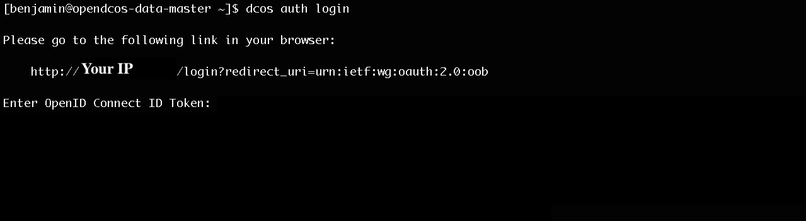

# DC/OS Marathon Operation

## [Managing Authentication](https://dcos.io/docs/1.7/administration/id-and-access-mgt/managing-authentication/)

### 首先必須先Login DC/OS

```
dcos auth login
```


### 出現網址後，以gmail登入，取得Token，貼在Enter OpenID Connect ID Token之後。

### 接著就在調一下config，輸入DC/OS的網址：

```
dcos config set core.dcos_url http://xxx.xxx.xxx.xx/
```

### 確認一下Token：

```
dcos config show core.dcos_acs_token
```

###接下來的指令，只要輸入:

```
dcos marathon help
```
### 幾乎都能查到。以下紀錄幾個常用的指令。

---

### 新增Application

```
dcos marathon app add <json file>
```
### marathon 會依照json的內容新增Application，json的格式可參照[Application Basics](https://mesosphere.github.io/marathon/docs/application-basics.html)。

### 查看Application List
```
dcos marathon app list
```

### 移除Application

```
dcos marathon app remove <application name>
```

### 新增group

```
dcos marathon group add <group name>
```

### group其實就是一個資料夾，可以在其中再加新的Application，之後scale in/out，就可以針對整個group處理。

---

### 調整Application的資源：basic-0是Application的名稱，basic-0所用的CPU被調整成0.1，Memory為10M。

```
dcos marathon app update basic-0 cpus=0.1 mem=10
```

### 調整Group的資源：test是group名稱，test後面的2是指，將資源調整成目前的兩倍；同理，若數字為0.5，則為目前資源的一半。

```
dcos marathon group scale test 2
```